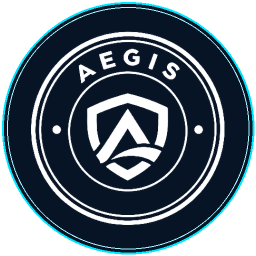
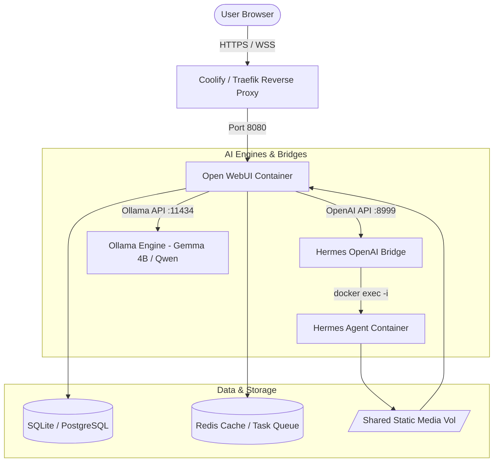

# Aegis AI — Enterprise Intelligence Platform

<p align="center">
  
</p>

<p align="center">
  <strong>Enterprise Zero-Trust Autonomous Intelligence Platform</strong><br>
  Built by Maudy Network • Powered by Open WebUI, Hermes Agent & Ollama
</p>

---

## 📌 Overview

**Aegis AI** is an enterprise-grade AI operating platform designed for secure, multi-agent autonomous reasoning, local private execution, and zero-trust data sovereignty. It integrates an executive frontend experience with backend agent capabilities including tool execution, media generation/retrieval, and fast local LLM inferencing.

---

## 🏗️ Architecture



---

## 🚀 Key Features

1. **Executive Dual-Mode UI System:**
   - Tailored executive theme inspired by Claude, Linear, and macOS aesthetics.
   - Clean dark/light mode switching with custom CSS variables and typography (`Inter` + `JetBrains Mono`).
   - macOS-style window code block controls and omnibar focus glow.
   - Zero-trust sovereignty indicator (`exac-cluster-01` node telemetry).

2. **Hermes Autonomous Agent Bridge (`hermes_openai_bridge.py`):**
   - OpenAI-compatible `/v1/chat/completions` API server that communicates directly with Hermes Agent CLI.
   - Automatic media interceptor: detects `MEDIA:<path>` outputs (images, audio, documents), mirrors them into Open WebUI's static media store, and renders rich Markdown previews.
   - Clean HTTP streaming with connection termination to prevent orphaned background tasks and infinite loading states.

3. **Multi-Model Orchestration:**
   - **Aegis Agent (Hermes)**: Autonomous multi-step execution, research, and tool-assisted workflows.
   - **Gemma 4B / Local LLMs**: Fast, lightweight single-turn conversations and background summarization.

---

## 📁 Repository Structure

```
├── assets/                       # Static UI icons, logos, and badges
├── css/                          # Web and landing styles
├── js/                           # Frontend utility scripts
├── new_brand_assets/             # Brand identity and vector exports
├── openwebui/
│   ├── aegis-openwebui-theme.css # Master enterprise stylesheet for Open WebUI
│   └── openwebui-instructions.md # UI setup and customization guidelines
├── index.html                    # Aegis AI Executive Pitch & Presentation Portal
├── loader.js                     # Dynamic runtime branding and DOM enhancer
├── hermes_openai_bridge.py       # OpenAI-compatible Bridge for Hermes Agent
├── patch_server.py               # Automated Open WebUI server-side brand patcher
├── register_hermes_in_openwebui.py # Script to register Aegis Agent into webui.db
├── deploy_agent.sh               # Asset deployment script
├── deploy_ui.sh                  # UI deployment script
└── .env.example                  # Environment configuration template
```

---

## ⚙️ Quick Start

### 1. Prerequisites
- Docker & Docker Compose
- Python 3.10+
- Open WebUI running container
- Hermes Agent container

### 2. Environment Configuration
Copy `.env.example` to `.env`:
```bash
cp .env.example .env
```
Fill in your host credentials:
```ini
SERVER_HOST=your_server_ip
SERVER_USER=your_username
SERVER_PASS=your_password
PORT=8999
```

### 3. Deploy Hermes Bridge
Run the bridge service locally or on the target VPS:
```bash
python3 hermes_openai_bridge.py
```
Or install as a systemd service:
```bash
python3 install_bridge_on_server.py
```

---

## 🛡️ License

Proprietary enterprise solution developed by **Maudy Network**. All rights reserved.
